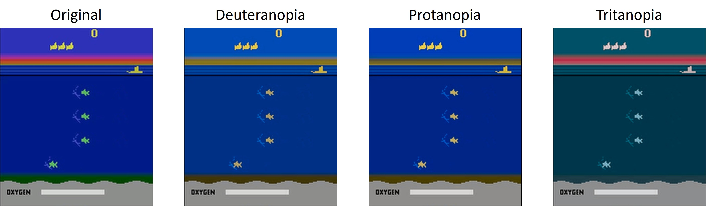
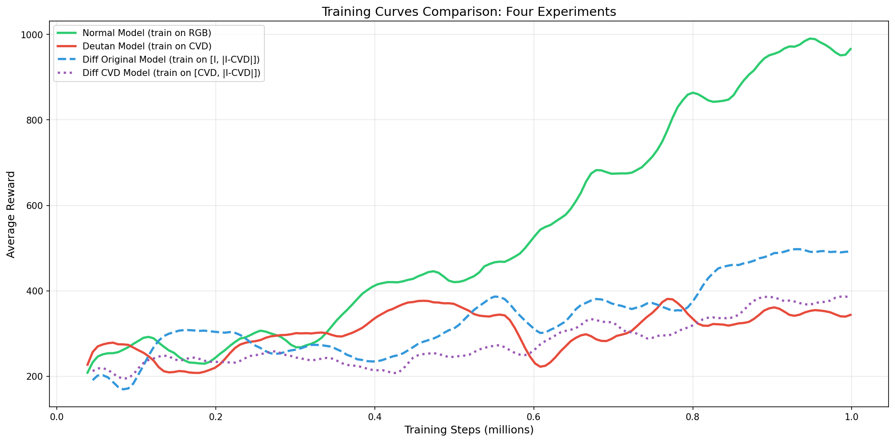
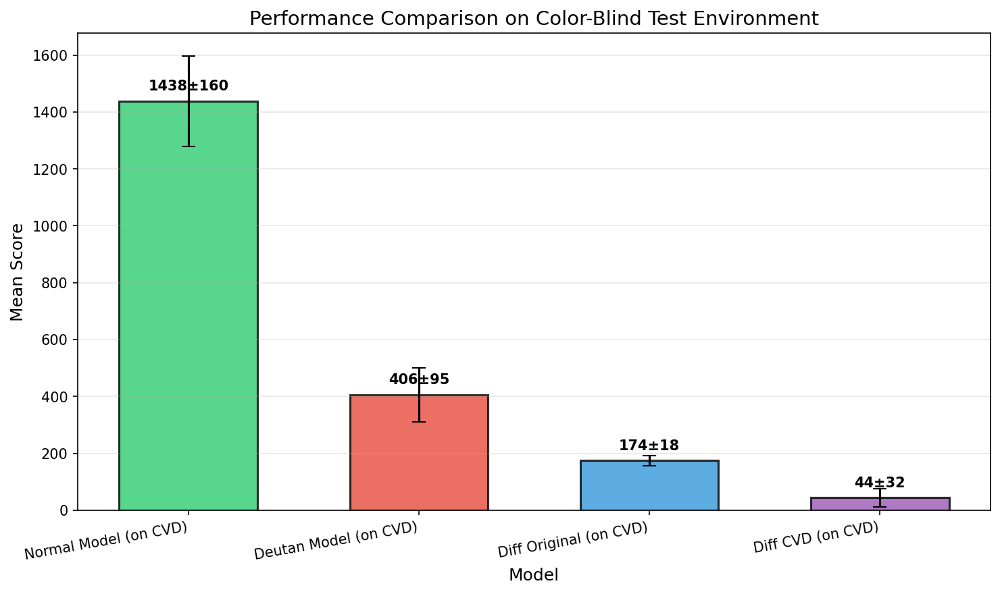

# Seaquest CVD: Color-Blind Robust Reinforcement Learning

**A comparative study of PPO agents on Seaquest showing that training on original RGB outperforms all CVD-specialized approaches.**

## Project Overview

This project investigates whether reinforcement learning (RL) agents can learn robust policies that generalize to color vision deficiency (CVD) without retraining. We compare four approaches on the Atari game Seaquest using Proximal Policy Optimization (PPO):

|  Model Name   | Training Input |  Test Input   |     Result     |
| :-----------: | :------------: | :-----------: | :------------: |
|    Normal     |      $I$       |   $CVD(I)$    | **1438 ± 160** |
|    Deutan     |    $CVD(I)$    |   $CVD(I)$    |    406 ± 95    |
| Diff Original |    $[I, D]$    | $[CVD(I), D]$ |    174 ± 18    |
|   Diff CVD    | $[CVD(I), D]$  | $[CVD(I), D]$ |    44 ± 32     |

Among them:

|           Symbol            |                 Significance                  |     Information Content      |
| :-------------------------: | :-------------------------------------------: | :--------------------------: |
|             $I$             |              Normal visual image              | Complete color (12 channels) |
|          $CVD(I)$           |  Simulate the image seen by color-blindness   | Degraded color (12 channels) |
| $D = \lvert I-CVD(I)\rvert$ | Map with lost colors between $I$ and $CVD(I)$ |   Highlight the lost area    |
|          $[I, D]$           |         Complete image + Lost prompt          |         24 channels          |
|        $[CVD(I), D]$        |         Degraded image + Lost prompt          |         24 channels          |

Note: The symbol "+" indicates that two images are concatenated along the channel dimension.

**Key finding**: The simplest approach (training on original RGB $I$) achieves the best CVD test performance (1438), outperforming direct CVD training (406) by **254%**.

## Features



- Complete PPO implementation with **JAX + Equinox**.
- CVD simulation using Brettel (1997) method via **daltonlens**.
- Difference map wrapper for auxiliary input experiments.
- High-quality video recording with multi-channel support.
- Automatic visualization of training curves and performance comparison.
- One-command experiment runner (train + evaluate + visualize).

## Project Structure

```
SeaquestCVD/
├── agents/                 # PPO agent and CNN network
│   ├── __init__.py
│   ├── network.py         # CNN policy (supports 12/24 channels)
│   └── ppo.py             # PPO agent implementation
├── env/                   # Environment wrappers
│   ├── __init__.py
│   ├── atari_wrapper.py   # FrameSkip, Resize, FrameStack
│   ├── cvd_simulation.py  # Brettel CVD simulator
│   ├── diff_wrapper.py    # Difference map wrappers
│   └── augmentation_wrapper.py
├── utils/                 # Utilities
│   ├── __init__.py
│   ├── buffer.py          # Rollout buffer with GAE
│   ├── logger.py
│   ├── metrics.py
│   ├── video_recorder.py  # Video recording
│   └── setup_directories.py
├── run.py                 # One-click experiment runner
├── train.py               # Training script
├── evaluate.py            # Evaluation script
├── visualize.py           # Plot generation
├── record.py              # Video recording
├── config.yaml            # Configuration file
└── requirements.txt       # Dependencies
```

## Quick Start

### Environment Setup

```bash
# 1. Clone the repository
git clone https://github.com/elowendeng/SeaquestCVD.git
cd SeaquestCVD

# 2. Create conda environment (recommended)
conda create -n sea_cvd python=3.10
conda activate sea_cvd

# 3. Install dependencies
pip3 install torch torchvision --index-url https://download.pytorch.org/whl/cu128
pip install -r requirements.txt

# 4. Install Atari ROMs
AutoROM --accept-license
```

The command to install PyTorch can be found on the webpage: [Get Started](https://pytorch.org/get-started/locally/). Before that, you need to run the command: `nvcc --version` to check the CUDA version.

### Run all experiments (recommended)

```bash
# "debug" mode (10k steps, used for quick verification of whether it can be executed.)
python run.py --mode debug --clean --record-final-video --gpu

# "quick" mode (100k steps)
# "medium" mode (500k steps)

# "full" mode (1M steps, add the function of recording videos during training.)
# [recommended]
python run.py --mode full --clean --record-final-video --gpu --record-video-interval 100_000
```

### Run individual experiments

```bash
# Exp 1: Train Normal model
python train.py --cvd-type normal --total-timesteps 1000000 --record-video-interval 100000 --video-length 2000

# Exp 2: Train Deutan model
python train.py --cvd-type deutan --total-timesteps 1000000 --record-video-interval 100000 --video-length 2000 --use-augmentation

# Exp 3: Train Diff Original model
python train.py --cvd-type normal --use-diff-training --diff-training-mode original \
    --output-dir results/diff_original_model --total-timesteps 1000000 \
    --record-video-interval 100000 --video-length 2000 --use-augmentation

# Exp 4: Train Diff CVD model
python train.py --cvd-type normal --use-diff-training --diff-training-mode cvd \
    --output-dir results/diff_cvd_model --total-timesteps 1000000 \
    --record-video-interval 100000 --video-length 2000 --use-augmentation
```

This generates:
- `results/normal_model`
- `results/deutan_model`
- `results/diff_original_model`
- `results/diff_cvd_model`

Each of these folders contains subfolders named `checkpoints` (which store the best and final checkpoints), `logs` (where the "training_log" is used to plot the training curve), and `videos` (which record the training process).

### Evaluate models

```bash
# Exp 1a: Evaluate Normal model on RGB
python evaluate.py --checkpoint results/normal_model/checkpoints/best.eqx \
    --cvd-type normal --severity 0.0 --num-episodes 10

# Exp 1b: Evaluate Normal model on CVD
python evaluate.py --checkpoint results/normal_model/checkpoints/best.eqx \
    --cvd-type deutan --severity 1.0 --num-episodes 10

# Exp 2: Evaluate Deutan model on CVD
python evaluate.py --checkpoint results/deutan_model/checkpoints/best.eqx \
    --cvd-type deutan --severity 1.0 --num-episodes 10

# Exp 3a: Evaluate Diff Original model on CVD
python evaluate.py --checkpoint results/diff_original_model/checkpoints/best.eqx \
    --cvd-type normal --severity 0.0 --num-episodes 10 \
    --use-diff-training --diff-training-mode original

# Exp 3b: Evaluate Diff Original model on CVD
python evaluate.py --checkpoint results/diff_original_model/checkpoints/best.eqx \
    --cvd-type deutan --severity 1.0 --num-episodes 10 \
    --use-diff-training --diff-training-mode cvd

# Exp 3c: Evaluate Diff CVD model on CVD
python evaluate.py --checkpoint results/diff_cvd_model/checkpoints/best.eqx \
    --cvd-type deutan --severity 1.0 --num-episodes 10 \
    --use-diff-training --diff-training-mode cvd
```

Running these commands will generate an `evaluation` folder in each model folder under the `results` folder, and the evaluation results will be recorded there.

### Generate visualizations

```bash
python visualize.py
```

This generates:
- `results/comparison/training_curves.png` - Training curves of all models.
- `results/comparison/cvd_effect.png` - Visualization of CVD simulation at different severities.
- `results/comparison/performance_comparison.png` - Bar chart comparing test performances.

## Configuration

Edit `config.yaml` to adjust hyperparameters:

```yaml
environment:
  frame_stack: 4
  frame_skip: 4
  screen_size: 84
  max_episode_steps: 2000

training:
  total_timesteps: 1000000
  learning_rate: 2.5e-4
  gamma: 0.99
  gae_lambda: 0.95
  clip_epsilon: 0.2
  ent_coef: 0.01
```

## Results

### Training Curves



- `Normal Model` *(Green solid curve)*: Best reward $\rightarrow$ **1055.00**, completed in **11913.6** seconds.
- `Deutan Model` *(Red solid curve)*: Best reward $\rightarrow$ **425.80**, completed in **12655.0** seconds.
- `Diff Original Model` *(Blue dotted curve)*: Best reward $\rightarrow$ **521.40**, completed in **16830.2** seconds.
- `Diff CVD Model` *(Purple dotted curve)*: Best reward $\rightarrow$ **418.00**. 

### Performance Comparison



## Key Insights

1. **Train on full color, test on CVD**: The standard model trained on original RGB achieved the best CVD test performance, actually exceeding its own training reward.

2. **Direct CVD training underperforms**: Training directly on degraded inputs harms feature learning.

3. **Difference maps fail**: Adding auxiliary information about color loss does not help, it dilutes limited discriminative signals.

## License

This project is licensed under the MIT License - see the [LICENSE](LICENSE) file for details.

## Contact Information

Project Lead: Nan Deng ([cbhsfmf0206@gmail.com](mailto:cbhsfmf0206@gmail.com))

Project Link: https://github.com/elowendeng/SeaquestCVD

## Acknowledgments

- [DaltonLens-Python](https://github.com/DaltonLens/DaltonLens-Python) for CVD simulation.
- [Equinox](https://github.com/patrick-kidger/equinox) for JAX neural networks.
- [ALE](https://github.com/mgbellemare/Arcade-Learning-Environment) for Atari environment.

Appreciate for the assistance provided by the "2025-2-CISC7404-001 SPECIAL TOPICS IN ARTIFICIAL INTELLIGENCE" course at the University of Macau!
